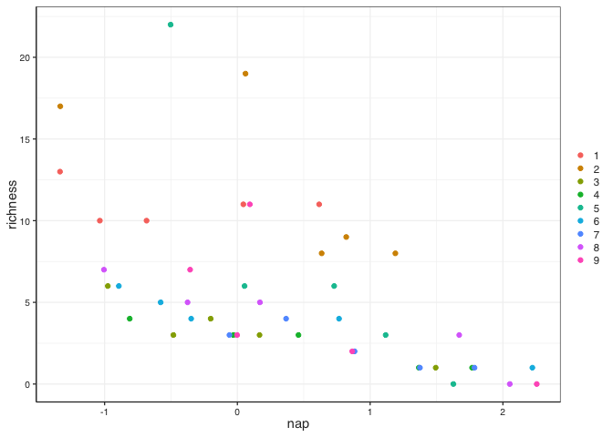

# Read the data

The first thing we need to do is to read the data. Notice that this is a text file, so we will nee dto use the `read_delim()` function. Exploring the file we see that the separator is a tab.


```r
beach_data_original <- read_delim(here("data", "beach_data.txt"), delim = "\t")


beach_data_original
```

```
## # A tibble: 45 × 5
##    Sample Richness Exposure    NAP Beach
##     <dbl>    <dbl>    <dbl>  <dbl> <dbl>
##  1      1       11       10  0.045     1
##  2      2       10       10 -1.04      1
##  3      3       13       10 -1.34      1
##  4      4       11       10  0.616     1
##  5      5       10       10 -0.684     1
##  6      6        8        8  1.19      2
##  7      7        9        8  0.82      2
##  8      8        8        8  0.635     2
##  9      9       19        8  0.061     2
## 10     10       17        8 -1.33      2
## # … with 35 more rows
```


Remember this is data collected from nine inter-tidal areas along the Dutch coast as presented in [Zuur et al. (2007)](https://highstat.com/index.php/analysing-ecological-data). For this assignment we are going to focus on the relationship between tow variables:  **species richness** (the number of different species) and **NAP** (the height of a sampling station compared to mean tidal level). or more precisely wether NAP has an influence on species richness. We will be assessing this relationship for each of the 9 beaches that were sampled for this study.

# Data clean up

First we will do some basic clean up of the variable names and to make our life a bit easier we will just select the variables we need: beach, richness and nap


```r
beach_data <- beach_data_original %>% 
  clean_names() %>% 
  select(beach, richness, nap)

beach_data
```

```
## # A tibble: 45 × 3
##    beach richness    nap
##    <dbl>    <dbl>  <dbl>
##  1     1       11  0.045
##  2     1       10 -1.04 
##  3     1       13 -1.34 
##  4     1       11  0.616
##  5     1       10 -0.684
##  6     2        8  1.19 
##  7     2        9  0.82 
##  8     2        8  0.635
##  9     2       19  0.061
## 10     2       17 -1.33 
## # … with 35 more rows
```


# Model fits

Now we are going to run the `lm()` for `richness` (the y) vs `nap` (the x). In order to make the results easier to handle, we want to extract the most relevant data from these models into their own columns. 


```r
beach_data_and_lm <- beach_data %>% 
  group_by(beach) %>% 
  nest() %>% 
  mutate(model = pmap(list(data),
                   ~ lm(richness ~ nap, data = ..1))) %>%  # Main model fit
  mutate(intercept = map_dbl(.x = model,
                             ~ round(tidy(.x)$estimate[1], digits = 3)), # extract the intercept into its own column
         slope = map_dbl(.x = model,
                         ~ round(tidy(.x)$estimate[2], digits = 4)), # extract the slope into its own column
         r_squared = map_dbl(.x = model,
                             ~ round(glance(.x)$r.squared, digits = 3)), # extract the r_squared into its own column
         p_value = map_dbl(.x = model,
                           ~ round(glance(.x)$p.value, digits = 3)) # extract the p_value into its own column
  )

beach_data_and_lm
```

```
## # A tibble: 9 × 7
## # Groups:   beach [9]
##   beach data             model  intercept  slope r_squared p_value
##   <dbl> <list>           <list>     <dbl>  <dbl>     <dbl>   <dbl>
## 1     1 <tibble [5 × 2]> <lm>       10.8  -0.372     0.059   0.694
## 2     2 <tibble [5 × 2]> <lm>       13.3  -4.18      0.592   0.128
## 3     3 <tibble [5 × 2]> <lm>        3.40 -1.76      0.814   0.036
## 4     4 <tibble [5 × 2]> <lm>        3.09 -1.25      0.941   0.006
## 5     5 <tibble [5 × 2]> <lm>       12.8  -8.90      0.776   0.048
## 6     6 <tibble [5 × 2]> <lm>        4.32 -1.39      0.896   0.015
## 7     7 <tibble [5 × 2]> <lm>        3.52 -1.52      0.749   0.058
## 8     8 <tibble [5 × 2]> <lm>        4.95 -1.89      0.886   0.017
## 9     9 <tibble [5 × 2]> <lm>        6.30 -2.97      0.495   0.185
```

Now let's format it a bit with `gt()` so it is easier to read by humans. One "problem" here is that we have the columns `data` and `model` which are filled with datasets. Those cannot be placed in a regular table, so we will remove them before we apply `gt()`.

Also remember that currently the data set is grouped by beach. If left untouched, it will create individual "groups" for each beach in the table, which is not needed and will look weird. We will ungroup before to avoid this.


```r
beach_data_and_lm %>% 
  select(-data, -model) %>% 
  ungroup() %>% 
  gt() %>% 
  tab_header(
    title = md("**Species richness vs NAP**"),
    subtitle = "Summary of the regression of species richness vs height of the sampling site for each of the studied beaches")
```

```{=html}
<div id="xoxfubzhcn" style="overflow-x:auto;overflow-y:auto;width:auto;height:auto;">
<style>html {
  font-family: -apple-system, BlinkMacSystemFont, 'Segoe UI', Roboto, Oxygen, Ubuntu, Cantarell, 'Helvetica Neue', 'Fira Sans', 'Droid Sans', Arial, sans-serif;
}

#xoxfubzhcn .gt_table {
  display: table;
  border-collapse: collapse;
  margin-left: auto;
  margin-right: auto;
  color: #333333;
  font-size: 16px;
  font-weight: normal;
  font-style: normal;
  background-color: #FFFFFF;
  width: auto;
  border-top-style: solid;
  border-top-width: 2px;
  border-top-color: #A8A8A8;
  border-right-style: none;
  border-right-width: 2px;
  border-right-color: #D3D3D3;
  border-bottom-style: solid;
  border-bottom-width: 2px;
  border-bottom-color: #A8A8A8;
  border-left-style: none;
  border-left-width: 2px;
  border-left-color: #D3D3D3;
}

#xoxfubzhcn .gt_heading {
  background-color: #FFFFFF;
  text-align: center;
  border-bottom-color: #FFFFFF;
  border-left-style: none;
  border-left-width: 1px;
  border-left-color: #D3D3D3;
  border-right-style: none;
  border-right-width: 1px;
  border-right-color: #D3D3D3;
}

#xoxfubzhcn .gt_title {
  color: #333333;
  font-size: 125%;
  font-weight: initial;
  padding-top: 4px;
  padding-bottom: 4px;
  padding-left: 5px;
  padding-right: 5px;
  border-bottom-color: #FFFFFF;
  border-bottom-width: 0;
}

#xoxfubzhcn .gt_subtitle {
  color: #333333;
  font-size: 85%;
  font-weight: initial;
  padding-top: 0;
  padding-bottom: 6px;
  padding-left: 5px;
  padding-right: 5px;
  border-top-color: #FFFFFF;
  border-top-width: 0;
}

#xoxfubzhcn .gt_bottom_border {
  border-bottom-style: solid;
  border-bottom-width: 2px;
  border-bottom-color: #D3D3D3;
}

#xoxfubzhcn .gt_col_headings {
  border-top-style: solid;
  border-top-width: 2px;
  border-top-color: #D3D3D3;
  border-bottom-style: solid;
  border-bottom-width: 2px;
  border-bottom-color: #D3D3D3;
  border-left-style: none;
  border-left-width: 1px;
  border-left-color: #D3D3D3;
  border-right-style: none;
  border-right-width: 1px;
  border-right-color: #D3D3D3;
}

#xoxfubzhcn .gt_col_heading {
  color: #333333;
  background-color: #FFFFFF;
  font-size: 100%;
  font-weight: normal;
  text-transform: inherit;
  border-left-style: none;
  border-left-width: 1px;
  border-left-color: #D3D3D3;
  border-right-style: none;
  border-right-width: 1px;
  border-right-color: #D3D3D3;
  vertical-align: bottom;
  padding-top: 5px;
  padding-bottom: 6px;
  padding-left: 5px;
  padding-right: 5px;
  overflow-x: hidden;
}

#xoxfubzhcn .gt_column_spanner_outer {
  color: #333333;
  background-color: #FFFFFF;
  font-size: 100%;
  font-weight: normal;
  text-transform: inherit;
  padding-top: 0;
  padding-bottom: 0;
  padding-left: 4px;
  padding-right: 4px;
}

#xoxfubzhcn .gt_column_spanner_outer:first-child {
  padding-left: 0;
}

#xoxfubzhcn .gt_column_spanner_outer:last-child {
  padding-right: 0;
}

#xoxfubzhcn .gt_column_spanner {
  border-bottom-style: solid;
  border-bottom-width: 2px;
  border-bottom-color: #D3D3D3;
  vertical-align: bottom;
  padding-top: 5px;
  padding-bottom: 5px;
  overflow-x: hidden;
  display: inline-block;
  width: 100%;
}

#xoxfubzhcn .gt_group_heading {
  padding-top: 8px;
  padding-bottom: 8px;
  padding-left: 5px;
  padding-right: 5px;
  color: #333333;
  background-color: #FFFFFF;
  font-size: 100%;
  font-weight: initial;
  text-transform: inherit;
  border-top-style: solid;
  border-top-width: 2px;
  border-top-color: #D3D3D3;
  border-bottom-style: solid;
  border-bottom-width: 2px;
  border-bottom-color: #D3D3D3;
  border-left-style: none;
  border-left-width: 1px;
  border-left-color: #D3D3D3;
  border-right-style: none;
  border-right-width: 1px;
  border-right-color: #D3D3D3;
  vertical-align: middle;
}

#xoxfubzhcn .gt_empty_group_heading {
  padding: 0.5px;
  color: #333333;
  background-color: #FFFFFF;
  font-size: 100%;
  font-weight: initial;
  border-top-style: solid;
  border-top-width: 2px;
  border-top-color: #D3D3D3;
  border-bottom-style: solid;
  border-bottom-width: 2px;
  border-bottom-color: #D3D3D3;
  vertical-align: middle;
}

#xoxfubzhcn .gt_from_md > :first-child {
  margin-top: 0;
}

#xoxfubzhcn .gt_from_md > :last-child {
  margin-bottom: 0;
}

#xoxfubzhcn .gt_row {
  padding-top: 8px;
  padding-bottom: 8px;
  padding-left: 5px;
  padding-right: 5px;
  margin: 10px;
  border-top-style: solid;
  border-top-width: 1px;
  border-top-color: #D3D3D3;
  border-left-style: none;
  border-left-width: 1px;
  border-left-color: #D3D3D3;
  border-right-style: none;
  border-right-width: 1px;
  border-right-color: #D3D3D3;
  vertical-align: middle;
  overflow-x: hidden;
}

#xoxfubzhcn .gt_stub {
  color: #333333;
  background-color: #FFFFFF;
  font-size: 100%;
  font-weight: initial;
  text-transform: inherit;
  border-right-style: solid;
  border-right-width: 2px;
  border-right-color: #D3D3D3;
  padding-left: 5px;
  padding-right: 5px;
}

#xoxfubzhcn .gt_stub_row_group {
  color: #333333;
  background-color: #FFFFFF;
  font-size: 100%;
  font-weight: initial;
  text-transform: inherit;
  border-right-style: solid;
  border-right-width: 2px;
  border-right-color: #D3D3D3;
  padding-left: 5px;
  padding-right: 5px;
  vertical-align: top;
}

#xoxfubzhcn .gt_row_group_first td {
  border-top-width: 2px;
}

#xoxfubzhcn .gt_summary_row {
  color: #333333;
  background-color: #FFFFFF;
  text-transform: inherit;
  padding-top: 8px;
  padding-bottom: 8px;
  padding-left: 5px;
  padding-right: 5px;
}

#xoxfubzhcn .gt_first_summary_row {
  border-top-style: solid;
  border-top-color: #D3D3D3;
}

#xoxfubzhcn .gt_first_summary_row.thick {
  border-top-width: 2px;
}

#xoxfubzhcn .gt_last_summary_row {
  padding-top: 8px;
  padding-bottom: 8px;
  padding-left: 5px;
  padding-right: 5px;
  border-bottom-style: solid;
  border-bottom-width: 2px;
  border-bottom-color: #D3D3D3;
}

#xoxfubzhcn .gt_grand_summary_row {
  color: #333333;
  background-color: #FFFFFF;
  text-transform: inherit;
  padding-top: 8px;
  padding-bottom: 8px;
  padding-left: 5px;
  padding-right: 5px;
}

#xoxfubzhcn .gt_first_grand_summary_row {
  padding-top: 8px;
  padding-bottom: 8px;
  padding-left: 5px;
  padding-right: 5px;
  border-top-style: double;
  border-top-width: 6px;
  border-top-color: #D3D3D3;
}

#xoxfubzhcn .gt_striped {
  background-color: rgba(128, 128, 128, 0.05);
}

#xoxfubzhcn .gt_table_body {
  border-top-style: solid;
  border-top-width: 2px;
  border-top-color: #D3D3D3;
  border-bottom-style: solid;
  border-bottom-width: 2px;
  border-bottom-color: #D3D3D3;
}

#xoxfubzhcn .gt_footnotes {
  color: #333333;
  background-color: #FFFFFF;
  border-bottom-style: none;
  border-bottom-width: 2px;
  border-bottom-color: #D3D3D3;
  border-left-style: none;
  border-left-width: 2px;
  border-left-color: #D3D3D3;
  border-right-style: none;
  border-right-width: 2px;
  border-right-color: #D3D3D3;
}

#xoxfubzhcn .gt_footnote {
  margin: 0px;
  font-size: 90%;
  padding-left: 4px;
  padding-right: 4px;
  padding-left: 5px;
  padding-right: 5px;
}

#xoxfubzhcn .gt_sourcenotes {
  color: #333333;
  background-color: #FFFFFF;
  border-bottom-style: none;
  border-bottom-width: 2px;
  border-bottom-color: #D3D3D3;
  border-left-style: none;
  border-left-width: 2px;
  border-left-color: #D3D3D3;
  border-right-style: none;
  border-right-width: 2px;
  border-right-color: #D3D3D3;
}

#xoxfubzhcn .gt_sourcenote {
  font-size: 90%;
  padding-top: 4px;
  padding-bottom: 4px;
  padding-left: 5px;
  padding-right: 5px;
}

#xoxfubzhcn .gt_left {
  text-align: left;
}

#xoxfubzhcn .gt_center {
  text-align: center;
}

#xoxfubzhcn .gt_right {
  text-align: right;
  font-variant-numeric: tabular-nums;
}

#xoxfubzhcn .gt_font_normal {
  font-weight: normal;
}

#xoxfubzhcn .gt_font_bold {
  font-weight: bold;
}

#xoxfubzhcn .gt_font_italic {
  font-style: italic;
}

#xoxfubzhcn .gt_super {
  font-size: 65%;
}

#xoxfubzhcn .gt_footnote_marks {
  font-style: italic;
  font-weight: normal;
  font-size: 75%;
  vertical-align: 0.4em;
}

#xoxfubzhcn .gt_asterisk {
  font-size: 100%;
  vertical-align: 0;
}

#xoxfubzhcn .gt_indent_1 {
  text-indent: 5px;
}

#xoxfubzhcn .gt_indent_2 {
  text-indent: 10px;
}

#xoxfubzhcn .gt_indent_3 {
  text-indent: 15px;
}

#xoxfubzhcn .gt_indent_4 {
  text-indent: 20px;
}

#xoxfubzhcn .gt_indent_5 {
  text-indent: 25px;
}
</style>
<table class="gt_table">
  <thead class="gt_header">
    <tr>
      <td colspan="5" class="gt_heading gt_title gt_font_normal" style><strong>Species richness vs NAP</strong></td>
    </tr>
    <tr>
      <td colspan="5" class="gt_heading gt_subtitle gt_font_normal gt_bottom_border" style>Summary of the regression of species richness vs height of the sampling site for each of the studied beaches</td>
    </tr>
  </thead>
  <thead class="gt_col_headings">
    <tr>
      <th class="gt_col_heading gt_columns_bottom_border gt_right" rowspan="1" colspan="1" scope="col">beach</th>
      <th class="gt_col_heading gt_columns_bottom_border gt_right" rowspan="1" colspan="1" scope="col">intercept</th>
      <th class="gt_col_heading gt_columns_bottom_border gt_right" rowspan="1" colspan="1" scope="col">slope</th>
      <th class="gt_col_heading gt_columns_bottom_border gt_right" rowspan="1" colspan="1" scope="col">r_squared</th>
      <th class="gt_col_heading gt_columns_bottom_border gt_right" rowspan="1" colspan="1" scope="col">p_value</th>
    </tr>
  </thead>
  <tbody class="gt_table_body">
    <tr><td class="gt_row gt_right">1</td>
<td class="gt_row gt_right">10.822</td>
<td class="gt_row gt_right">-0.3718</td>
<td class="gt_row gt_right">0.059</td>
<td class="gt_row gt_right">0.694</td></tr>
    <tr><td class="gt_row gt_right">2</td>
<td class="gt_row gt_right">13.346</td>
<td class="gt_row gt_right">-4.1753</td>
<td class="gt_row gt_right">0.592</td>
<td class="gt_row gt_right">0.128</td></tr>
    <tr><td class="gt_row gt_right">3</td>
<td class="gt_row gt_right">3.401</td>
<td class="gt_row gt_right">-1.7554</td>
<td class="gt_row gt_right">0.814</td>
<td class="gt_row gt_right">0.036</td></tr>
    <tr><td class="gt_row gt_right">4</td>
<td class="gt_row gt_right">3.088</td>
<td class="gt_row gt_right">-1.2486</td>
<td class="gt_row gt_right">0.941</td>
<td class="gt_row gt_right">0.006</td></tr>
    <tr><td class="gt_row gt_right">5</td>
<td class="gt_row gt_right">12.783</td>
<td class="gt_row gt_right">-8.9002</td>
<td class="gt_row gt_right">0.776</td>
<td class="gt_row gt_right">0.048</td></tr>
    <tr><td class="gt_row gt_right">6</td>
<td class="gt_row gt_right">4.325</td>
<td class="gt_row gt_right">-1.3885</td>
<td class="gt_row gt_right">0.896</td>
<td class="gt_row gt_right">0.015</td></tr>
    <tr><td class="gt_row gt_right">7</td>
<td class="gt_row gt_right">3.521</td>
<td class="gt_row gt_right">-1.5176</td>
<td class="gt_row gt_right">0.749</td>
<td class="gt_row gt_right">0.058</td></tr>
    <tr><td class="gt_row gt_right">8</td>
<td class="gt_row gt_right">4.951</td>
<td class="gt_row gt_right">-1.8931</td>
<td class="gt_row gt_right">0.886</td>
<td class="gt_row gt_right">0.017</td></tr>
    <tr><td class="gt_row gt_right">9</td>
<td class="gt_row gt_right">6.295</td>
<td class="gt_row gt_right">-2.9675</td>
<td class="gt_row gt_right">0.495</td>
<td class="gt_row gt_right">0.185</td></tr>
  </tbody>
  
  
</table>
</div>
```

# Plots

Lets take a look at all the data toguether just to get an idea of how the data looks and help us select some values for the location of the annotations and scales.


```r
beach_data %>% 
  ggplot() +
  geom_point(aes(x = nap, y = richness, colour = factor(beach)))
```

<!-- -->

Now that we have a consolidated tibble with the data, the models, and the main descriptors of the regression, we can use this to create our plots.


```r
beach_plot <- beach_data_and_lm %>% 
  mutate(plot = pmap(list(data, beach, intercept, slope, r_squared),
                     ~ ggplot() +
                       geom_point(data = ..1, aes(x = nap, y = richness), alpha = 0.4, stroke = 0) +
                       geom_smooth(data = ..1, aes(x = nap, y = richness), method = "lm", 
                                   colour = "blue", size = 0.4) +
                       
                       annotate(geom = "text",
                                x = 1,
                                y = 30,
                                label = str_c("y = ", ..3, " + ", ..4 ,"x", sep = ""),
                                hjust = 0,
                                vjust = 0,
                                size = 3.5) +
                       
                       annotate(geom = "text",
                                x = 1,
                                y = 28,
                                label = str_c('R^2 == ', ..5),
                                parse = TRUE,
                                hjust = 0,
                                vjust = 0, 
                                size = 3.5) +
                       
                       coord_cartesian(xlim = c(min(beach_data$nap, na.rm = TRUE), max(beach_data$nap, na.rm = TRUE)),
                                       ylim = c(0, max(beach_data$richness, na.rm = TRUE)*1.5),
                                       expand = expansion(mult = 0, add = 0)) +
                       
                       labs(title = str_c("Beach", ..2, sep = " "),
                            x = "NAP (m)",
                            y = "Species richness")),
         
         filename = str_c("beach_", beach, "_plot.pdf", sep = "")) %>% 
  ungroup() %>% 
  select(plot, filename)

beach_plot
```

```
## # A tibble: 9 × 2
##   plot   filename        
##   <list> <chr>           
## 1 <gg>   beach_1_plot.pdf
## 2 <gg>   beach_2_plot.pdf
## 3 <gg>   beach_3_plot.pdf
## 4 <gg>   beach_4_plot.pdf
## 5 <gg>   beach_5_plot.pdf
## 6 <gg>   beach_6_plot.pdf
## 7 <gg>   beach_7_plot.pdf
## 8 <gg>   beach_8_plot.pdf
## 9 <gg>   beach_9_plot.pdf
```


Now that we have a simplified tibble with just the plots and the given file names, i can use `pwalk()` to walk through the list and apply `ggsave()` to each of them


```r
beach_plot %>% 
  pwalk(ggsave,                    # what we want to do as we walk thorugh the object   
        path =  here("figures"),   # where we want to save it
        width = 120, height = 120, units = "mm") # other things you need for ggsave
```

```
## `geom_smooth()` using formula 'y ~ x'
```

```
## Warning in if (!expand) {: the condition has length > 1 and only the first
## element will be used

## Warning in if (!expand) {: the condition has length > 1 and only the first
## element will be used
```

```
## `geom_smooth()` using formula 'y ~ x'
```

```
## Warning in if (!expand) {: the condition has length > 1 and only the first
## element will be used

## Warning in if (!expand) {: the condition has length > 1 and only the first
## element will be used
```

```
## `geom_smooth()` using formula 'y ~ x'
```

```
## Warning in if (!expand) {: the condition has length > 1 and only the first
## element will be used

## Warning in if (!expand) {: the condition has length > 1 and only the first
## element will be used
```

```
## `geom_smooth()` using formula 'y ~ x'
```

```
## Warning in if (!expand) {: the condition has length > 1 and only the first
## element will be used

## Warning in if (!expand) {: the condition has length > 1 and only the first
## element will be used
```

```
## `geom_smooth()` using formula 'y ~ x'
```

```
## Warning in if (!expand) {: the condition has length > 1 and only the first
## element will be used

## Warning in if (!expand) {: the condition has length > 1 and only the first
## element will be used
```

```
## `geom_smooth()` using formula 'y ~ x'
```

```
## Warning in if (!expand) {: the condition has length > 1 and only the first
## element will be used

## Warning in if (!expand) {: the condition has length > 1 and only the first
## element will be used
```

```
## `geom_smooth()` using formula 'y ~ x'
```

```
## Warning in if (!expand) {: the condition has length > 1 and only the first
## element will be used

## Warning in if (!expand) {: the condition has length > 1 and only the first
## element will be used
```

```
## `geom_smooth()` using formula 'y ~ x'
```

```
## Warning in if (!expand) {: the condition has length > 1 and only the first
## element will be used

## Warning in if (!expand) {: the condition has length > 1 and only the first
## element will be used
```

```
## `geom_smooth()` using formula 'y ~ x'
```

```
## Warning in if (!expand) {: the condition has length > 1 and only the first
## element will be used

## Warning in if (!expand) {: the condition has length > 1 and only the first
## element will be used
```


